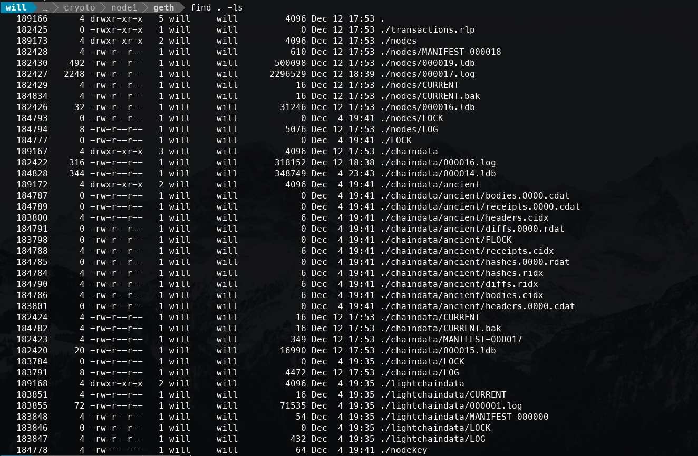

# Requirements
- geth
- puppeth

# Proof of Work Local Cryptocurrency Network

1. Create Network and Genesis Block using `puppeth`

2. Using `geth` create 2 virtual nodes on our network

    - This is what the node folder structure looks like

    

3. Initialize each folder to the network `crychain`

    - `./geth init crychain.json --datadir node2`

4. Start up a mining thread/node (node1)

    - 

4. Start up a full thread/node (node2)

    - 

5. Connect MyCrypto
    - Enter in Network details
    - change networks
    - supply address
    - view outrageous balance

    - 